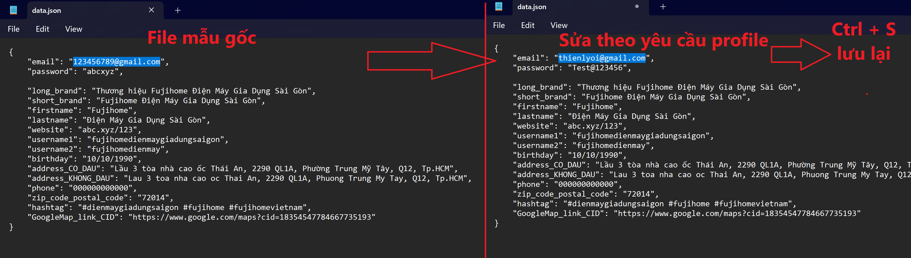

## MÔ TẢ KĨ THUẬT

- Khi click vào bất kỳ trường input hoặc textarea nào, content.js sẽ lắng nghe và lưu thông tin về trường đó.
- Sau đó, khi click chuột phải tại vị trí đó để gọi trình menu ngữ cảnh -> lựa chọn các nội dung khác nhau (do cá nhân đã cấu hình) tại các sub-menu (menu con) được xổ ra.
- Và cuối cùng, tại pop-up trình menu ngữ cảnh, khi trỏ chuột vào mục "Tự động điền dữ liệu" và lựa chọn các mục mong muốn, extension sẽ lấy dữ liệu từ file JSON và điền vào trường đã được focus trước đó.

<h2>YÊU CẦU TRƯỚC KHI CÀI ĐẶT EXTENSION</h2>

Không thể dùng được với các trình duyệt Safari / Firefox / Internet Explorer cũ

- Tải xuống (Download ZIP) bộ source tại địa chỉ https://github.com/TrHgTung/ho-tro-dien-thong-tin-dang-nhap-profile, sau đó giải nén ra và ghi nhớ vị trí thư mục đã giải nén.

 

- Thay đổi các nội dung cần thiết trong file data.json (Tùy biến)

 

 
<h2>CÁCH CÀI ĐẶT EXTENSION VÀO TRÌNH DUYỆT</h2>

- Bước 1: Vào cài đặt của trình duyệt (tùy vào từng trình duyệt khác nhau thì cách truy cập Settings cũng khác nhau) -> Quản lý tiện ích mở rộng (Extension) -> Tải các phần mở rộng chưa được đóng gói (Load unpacked)
   
  

- Bước 2: Trong cửa sổ Explorer hỏi chọn thư mục: Chọn folder chứa source của Extension và Import vào
  

- Bước 3: Ở phần thông tin extension: Chọn Xem chi tiết (Details) Cho phép chạy toàn quyền & chạy ở chế độ duyệt web riêng tư
  

<h2>CÁCH SỬ DỤNG EXTENSION</h2>

Trỏ chuột đến các trường cho phép nhập liệu -> Nhấn chuột phải để mở menu context -> Auto Fill Options -> lựa chọn tùy ý Autofill 1 / 2 hoặc 3 hoặc nhiều lựa chọn hơn (cái này do tự cấu hình)

 

